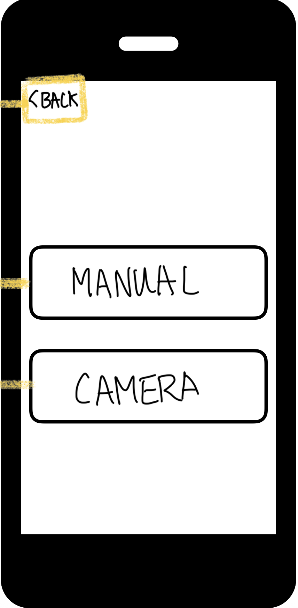

# 

# 

# [Project 1]

# UI(Detailed Design) Specification

Date Created: 07/11/25

Created by: Hungu Lim, Jisu Lim, Hyunsu Lim

Version: 1.0

[[UIID-000] Layout Design Overview	3](#uiid000layoutdesignoverview3)
[[UUID-001] StartUpView detail	4](#uuid001startupviewdetail4)
[[UUID-002] GameHomeView detail	5](#uuid002gamehomeviewdetail5)
			[(Fig. 1) GameHome Conceptual Design	6](#fig1gamehomeconceptualdesign6)
[[UUID-003] AboutView detail	7](#uuid003aboutviewdetail7)
			[(Fig. 2) About Conceptual Design	8](#fig2aboutconceptualdesign8)
[[UUID-004] HelpView detail	9](#uuid004helpviewdetail9)
			[(Fig. 3) Help Conceptual Design	10](#fig3helpconceptualdesign10)
[[UUID-005] LeaderBoardView detail	11](#uuid005leaderboardviewdetail11)
			[(Fig. 4) Leader Board Conceptual Design	12](#fig4leaderboardconceptualdesign12)
[[UUID-006] SettingView detail	13](#uuid006settingviewdetail13)
			[(Fig. 5) Setting Conceptual Design	14](#fig5settingconceptualdesign14)
[[UUID-007] LevelView detail	15](#uuid007levelviewdetail15)
			[(Fig. 6) Level Conceptual Design	16](#fig6levelconceptualdesign16)
[[UUID-008] ScoreView detail	17](#uuid008scoreviewdetail17)
			[(Fig. 7) Score Conceptual Design	19](#fig7scoreconceptualdesign19)
[[UUID-009] GameBoardView detail	20](#uuid009gameboardviewdetail20)
			[(Fig. 8) Game Board Conceptual Design	21](#fig8gameboardconceptualdesign21)
[[UUID-010] SolverView detail	22](#uuid010solverviewdetail22)
			[(Fig. 9) Solver Conceptual Design	23](#fig9solverconceptualdesign23)
[[UUID-011] SolutionView detail	24](#uuid011solutionviewdetail24)
			[(Fig. 10) Solution Conceptual Design	25](#fig10solutionconceptualdesign25)
[[UIID-TBD] Game Center Details (FR-13)	26](#uiidtbdgamecenterdetailsfr1326)
[Back Button	26](#backbutton26)
[Screen	26](#screen26)
[[UIID-TBD] Game Screen  Details (TBD, v2.0)	27](#uiidtbdgamescreendetailstbdv2027)
[Back Button	27](#backbutton27)
[“Single” Button	27](#singlebutton27)
[“Multi” Button	27](#multibutton27)
[[UIID-TBD] Capture Screen Details	28](#uiidtbdcapturescreendetails28)
[Back Button	28](#backbutton28)
[Screen	28](#screen28)
[Camera Button	28](#camerabutton28)
# 

# [UIID-000] Layout Design Overview

# 

# [UUID-001] StartUpView detail

Connects to [UXID-000](https://docs.google.com/document/d/1u0TZvop8mj24Qc8F9U_8gmA_11DPu_a0_A2RHEuICnk/edit?tab=t.0#heading=h.oylzsxjp3t1d) 

File name: StartUpView.swift (StartUp.storyboard를 생성하여 “Launch Screen File” 에 등록한다. SwiftUI에서 다른 Launch screen 등록 방법이 있으면 대체 할 수 있다.)

Implements:

1. HomeView 최초 화면 표시 전에 StartUp view를 표시한다.

2. (임시) 3초후 StartUp화면을 Hide 한다.

# [UUID-002] GameHomeView detail

Connects to [UXID-](https://docs.google.com/document/d/1u0TZvop8mj24Qc8F9U_8gmA_11DPu_a0_A2RHEuICnk/edit?tab=t.0#heading=h.cf1ohv9768b3)[00](https://docs.google.com/document/d/1u0TZvop8mj24Qc8F9U_8gmA_11DPu_a0_A2RHEuICnk/edit?tab=t.0#heading=h.cf1ohv9768b3)[1](https://docs.google.com/document/d/1u0TZvop8mj24Qc8F9U_8gmA_11DPu_a0_A2RHEuICnk/edit?tab=t.0#heading=h.cf1ohv9768b3) 

File name: GameHomeView.swift

Implements:

1. 6개의 버튼이 필요하다.

1. About - AboutView(Sheet type) 열기

2. Help - HelpView(Navigation Link type) 열기

3. Leader Board - LeaderBoardView(Sheet type) 열기

4. Setting - SettingView(Sheet type) 열기

5. Game- GameBoardView(Navigation Link type, 진입시 항상 LevelView ActionSheet type형 화면을 표시한다) 열기

6. Solver - SolverView(Navigation Link type) 열기

2. 1개의 Text가 필요하다.

7. “Ads”의 Placeholder가 될것이다.

 GameHome Conceptual Design")

##### (Fig. 1) GameHome Conceptual Design
##### 
# [UUID-003] AboutView detail

Connects to[ UXID-](https://docs.google.com/document/d/1u0TZvop8mj24Qc8F9U_8gmA_11DPu_a0_A2RHEuICnk/edit?tab=t.0#heading=h.dpoanieffg3k)[002](https://docs.google.com/document/d/1u0TZvop8mj24Qc8F9U_8gmA_11DPu_a0_A2RHEuICnk/edit?tab=t.0#heading=h.dpoanieffg3k) 

File name: AboutView.swift

Implements:

1. Type: Sheet

2. 밑으로 내리는 Swipe Action을 취하면 dismiss된다.

3. 3개의 Text가 필요하다.

1. Version Information

2. Developer Information

3. GNU License Information

4. Easter Egg는 TBD 로 결정하되 현재로선 버튼으로 구현되어 있다.

 About Conceptual Design")

##### (Fig. 2) About Conceptual Design

# 

# [UUID-004] HelpView detail

Connects to[ UXID-](https://docs.google.com/document/d/1u0TZvop8mj24Qc8F9U_8gmA_11DPu_a0_A2RHEuICnk/edit?tab=t.0#heading=h.wgh1tju4ajc5)[00](https://docs.google.com/document/d/1u0TZvop8mj24Qc8F9U_8gmA_11DPu_a0_A2RHEuICnk/edit?tab=t.0#heading=h.wgh1tju4ajc5)[4 ](https://docs.google.com/document/d/1u0TZvop8mj24Qc8F9U_8gmA_11DPu_a0_A2RHEuICnk/edit?tab=t.0#heading=h.wgh1tju4ajc5)

File name: HelpView.swift

Implements:

1. Type: Navigation Link

2. “< Back” Button이 자동으로 생성된다.

1. GameHomeView로 연결된다.

3. 여러개의 페이지가 존재할 예정이다. (TBD)

2. 여러개의 페이지를 구현할 방법이 모색되면 알맞게 버튼이나 뷰가 추가될 예정이다.

 Help Conceptual Design")

##### (Fig. 3) Help Conceptual Design

# 

# [UUID-005] LeaderBoardView detail

Connects to [UXID-](https://docs.google.com/document/d/1u0TZvop8mj24Qc8F9U_8gmA_11DPu_a0_A2RHEuICnk/edit?tab=t.0#heading=h.8aiqkkjs65ej)[012](https://docs.google.com/document/d/1u0TZvop8mj24Qc8F9U_8gmA_11DPu_a0_A2RHEuICnk/edit?tab=t.0#heading=h.8aiqkkjs65ej) 

File name: LeaderBoardView.swift

Implements:

1. Type: Sheet

2. 밑으로 내리는 Swipe Action을 취하면 뷰가 dismiss 된다.

3. 1개의 버튼을 가진다.

1. Clear Button

4. 1개의 Text를 가진다.

2. “Leaderboard View” 라고 적혀있으며 Placeholder이다.

 Leader Board Conceptual Design")

##### (Fig. 4) Leader Board Conceptual Design

# 

# [UUID-006] SettingView detail

Connects to [UXID-](https://docs.google.com/document/d/1u0TZvop8mj24Qc8F9U_8gmA_11DPu_a0_A2RHEuICnk/edit?tab=t.0#heading=h.h04ag8s8httz)[0](https://docs.google.com/document/d/1u0TZvop8mj24Qc8F9U_8gmA_11DPu_a0_A2RHEuICnk/edit?tab=t.0#heading=h.h04ag8s8httz)[13](https://docs.google.com/document/d/1u0TZvop8mj24Qc8F9U_8gmA_11DPu_a0_A2RHEuICnk/edit?tab=t.0#heading=h.h04ag8s8httz) 

File name: SettingView.swift

Implements:

1. Type: Sheet

2. 밑으로 내리는 Swipe Action을 취하면 뷰가 dismiss 된다.

3. 1개의 Toggle을 가진다.

1. Sound Toggle (Action TBD)

4. 2개의 Picker을 가진다.

2. Effects Segmented Picker (Action TBD)

3. Tile Patterns Segmented Picker (Action TBD)

 Setting Conceptual Design")

##### (Fig. 5) Setting Conceptual Design

# 

# [UUID-007] LevelView detail

Connects to [UXID-](https://docs.google.com/document/d/1u0TZvop8mj24Qc8F9U_8gmA_11DPu_a0_A2RHEuICnk/edit?tab=t.0#heading=h.fu6pj9lxeugc)[00](https://docs.google.com/document/d/1u0TZvop8mj24Qc8F9U_8gmA_11DPu_a0_A2RHEuICnk/edit?tab=t.0#heading=h.fu6pj9lxeugc)[6](https://docs.google.com/document/d/1u0TZvop8mj24Qc8F9U_8gmA_11DPu_a0_A2RHEuICnk/edit?tab=t.0#heading=h.fu6pj9lxeugc) 

File name: LevelView.swift

Implements:

1. Type: Navigation Link

2. “< Back” Button이 자동으로 만들어진다.

1. GameHomeView로 연결된다.

3. 4개의 Button을 갖는다

2. Easy

3. Medium

4. Hard

5. Resume

 Level Conceptual Design")

##### (Fig. 6) Level Conceptual Design

# 

# [UUID-008] ScoreView detail

Connects to [UXID-](https://docs.google.com/document/d/1u0TZvop8mj24Qc8F9U_8gmA_11DPu_a0_A2RHEuICnk/edit?tab=t.0#heading=h.whn6zythk9x)[00](https://docs.google.com/document/d/1u0TZvop8mj24Qc8F9U_8gmA_11DPu_a0_A2RHEuICnk/edit?tab=t.0#heading=h.whn6zythk9x)[8](https://docs.google.com/document/d/1u0TZvop8mj24Qc8F9U_8gmA_11DPu_a0_A2RHEuICnk/edit?tab=t.0#heading=h.whn6zythk9x) 

File name: ScoreView.swift

Implements:

1. Type: Sheet

2. 밑으로 내리는 Swipe Action을 취하면 dismiss 된다.

3. 1개의 Text

1. “Score View” Placeholder

 Score Conceptual Design")

##### (Fig. 7) Score Conceptual Design

# 

# [UUID-009] GameBoardView detail

Connects to [UXID-](https://docs.google.com/document/d/1u0TZvop8mj24Qc8F9U_8gmA_11DPu_a0_A2RHEuICnk/edit?tab=t.0#heading=h.41rvsmmfog15)[00](https://docs.google.com/document/d/1u0TZvop8mj24Qc8F9U_8gmA_11DPu_a0_A2RHEuICnk/edit?tab=t.0#heading=h.41rvsmmfog15)[7](https://docs.google.com/document/d/1u0TZvop8mj24Qc8F9U_8gmA_11DPu_a0_A2RHEuICnk/edit?tab=t.0#heading=h.41rvsmmfog15) 

File name: GameBoardView.swift

Implements:

1. Type: Navigation Link

2. “< Back” Button을 없앤다.

3. 6개의 Text가 존재한다.

1. “Error,” “Score,” “Time” 이 존재한다. (Placeholder)

2. “Board,” “Number Pad”, “Ads” 가 존재한다. (Placeholder)

4. (임시) “Score” Text를 LevelView 에서 선택한 Button의 값을 표시한다.

5. 5개의 버튼이 존재한다.

3. Rewind, Undo, Redo, Hint, Memo

 Game Board Conceptual Design")
(Fig. 8) Game Board Conceptual Design

# 

# [UUID-010] SolverView detail

Connects to [UXID-](https://docs.google.com/document/d/1u0TZvop8mj24Qc8F9U_8gmA_11DPu_a0_A2RHEuICnk/edit?tab=t.0#heading=h.c1mlmt2yuhtz)[00](https://docs.google.com/document/d/1u0TZvop8mj24Qc8F9U_8gmA_11DPu_a0_A2RHEuICnk/edit?tab=t.0#heading=h.c1mlmt2yuhtz)[9](https://docs.google.com/document/d/1u0TZvop8mj24Qc8F9U_8gmA_11DPu_a0_A2RHEuICnk/edit?tab=t.0#heading=h.c1mlmt2yuhtz) 

File name: SolverView.swift

Implements:

1. Type: Navigation Link

2. “< Back” Button이 자동으로 생성된다.

1. GameHomeView로 연결되어 있다.

3. 2개의 Button을 갖는다

2. Manual Button (Action: [SolutionView](?tab=t.0#heading=h.kh8c42izju7n) 열기)

3. Camera Button (Action TBD)

 Solver Conceptual Design")

##### (Fig. 9) Solver Conceptual Design

# 

# [UUID-011] SolutionView detail

Connects to [UXID-](https://docs.google.com/document/d/1u0TZvop8mj24Qc8F9U_8gmA_11DPu_a0_A2RHEuICnk/edit?tab=t.0#heading=h.d5hyhr3glsh4)[0](https://docs.google.com/document/d/1u0TZvop8mj24Qc8F9U_8gmA_11DPu_a0_A2RHEuICnk/edit?tab=t.0#heading=h.d5hyhr3glsh4)[10](https://docs.google.com/document/d/1u0TZvop8mj24Qc8F9U_8gmA_11DPu_a0_A2RHEuICnk/edit?tab=t.0#heading=h.d5hyhr3glsh4) 

File name: SolutionView.swift

Implements:

1. Type: Navigation Link

2. 1개의 Text를 가진다.

1. “Board”

3. 2개의 Button을 가진다.

2. “Solve it!”

3. “Home”

 Solution Conceptual Design")

##### (Fig. 10) Solution Conceptual Design

# [UIID-TBD] Game Center Details (FR-13)

|  | 
Connects to UXID-003
Back Button 
Connects to UXID-001
Screen
SRS Specification: FR-13.1
Will redirect to the Game Center(external connection)
게임센터로 연결된다(외부 연결)
 |
|---|---|

# [UIID-TBD] Game Screen  Details (TBD, v2.0)

|  | Connects to UXID-005
Back Button 
Connects to UXID-001
“Single” Button
Connects to UXID-006
SRS Specification: FR-1.2
“Multi” Button
To be determined in version 2.0 |
|---|---|

# 

# [UIID-TBD] Capture Screen Details

|  | Connects to UXID-011
Back Button 
Connects to UXID-009
Screen
Camera background, with guidelines indicating how to line up the sudoku board
Camera Button
When clicked, will capture Sudoku Board and automatically move to UXID-010 with filled Sudoku Board
 |
|---|---|
